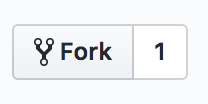

# Contributing Guidelines

To contribute to this repo, check the [issues page](https://github.com/fswebdev/practice-exercises/issues) for active requests. Requests will be tagged with their subject area. Feel free to add an issue, either for yourself to work on or for others to contribute to. If you notice a problem or area for improvement on an existing excercise, [create a new issue for it](https://github.com/fswebdev/practice-exercises/issues/new).

## The Contribution Workflow

In general, the contribution workflow looks like this:

### 1. Claim an Issue 

Once you've found the issue you want to work on via the [Issue Tracker](https://github.com/fswebdev/practice-exercises/issues), reply to it letting everyone know that you plan to work on it. Feel free to ask questions, discuss features, etc in the issue replies.

### 2. Fork the repo & clone locally

Start by forking the repo


This makes a copy of the repository on your account at 
```
https://github.com/USERNAME/practice-exercises
```

From there, clone it locally
```
https://github.com/USERNAME/practice-exercises.git
```

For more details on forking, read [Fork A Repo - User Documentation](https://help.github.com/articles/fork-a-repo/)

### 3. Create a new feature branch based off the `master` branch

Once you've cloned your fork, create a new branch to work on. We suggest following [feature-branch workflow](https://www.atlassian.com/git/tutorials/comparing-workflows#feature-branch-workflow).
```
git checkout -B BRANCH-NAME
```

### 4. Work off your new branch, commit changes, and push to your fork.

As you work on your contribution, make sure to follow some best [practices for commit messages](https://chris.beams.io/posts/git-commit/). Once you're complete, push the branch and changes up to Github.


### 5. Submit a pull request, referencing the issue number it addresses.

With your updated code now synced remotely with your fork, you can make a pull request to this repo. On your fork you should see a helpful notice and a button to create the PR.


Leave a message referencing the issue, tagging any necessary people, and describing your update. Make sure you've completed any pre-PR checks as noted in the pull request template. Also confirm that you've selected the right branches to merge. If there are conflicts preventing a merge, you'll want to make sure you've pulled and updates from the original repo that may have happened since you started working. Refer to [Syncing a fork - User Documentation](https://help.github.com/articles/syncing-a-fork/) for details on syncing changes to your fork.


After your pull request has been submitted, maintainers will get back to you as soon as possible with any feedback, change requests, or improvements. Once everything is set, your changes will be merged back into master!

More details on making a pull request can be found at [Creating a pull request - User Documentation](https://help.github.com/articles/creating-a-pull-request/).

## Additional Tips

- Always remember to pull in any updates from the original master before pushing changes. [Syncing a fork - User Documentation](https://help.github.com/articles/syncing-a-fork/)
- Write your documents in markdown. Github has a great [guide to markdown syntax](https://guides.github.com/features/mastering-markdown/).
- Update the exercises portion of the readme to include your new document
- Ask for help in the issue if needed